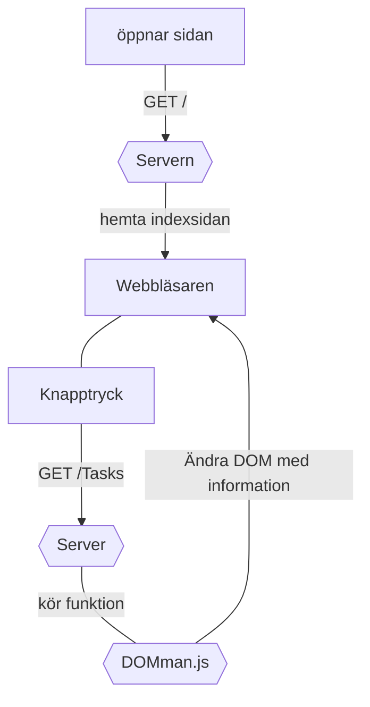

```mermaid
graph TD;
  id1[öppnar sidan] -->|GET /| id2{{Servern}}
  id2 -->|hemta indexsidan| id3[Webbläsaren]
  id3 --- id4[Knapptryck]
  id4 -->|GET /Tasks| id5{{Server}}
  id5 ---|kör funktion| id6{{DOMman.js}}
  id6 -->|Ändra DOM med information| id3
```
