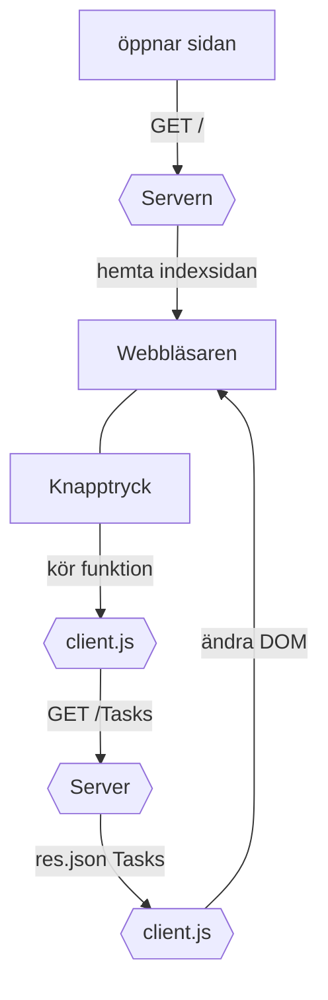

```mermaid
graph TD;
  id1[öppnar sidan] -->|GET /| id2{{Servern}}
  id2 -->|hemta indexsidan| id3[Webbläsaren]
  id3 --- id4[Knapptryck]
  id4 -->|kör funktion| id5{{client.js}}
  id5 -->|GET /Tasks| id6{{Server}}
  id6 -->|res.json Tasks| id7{{client.js}}
  id7 -->|ändra DOM| id3
```
